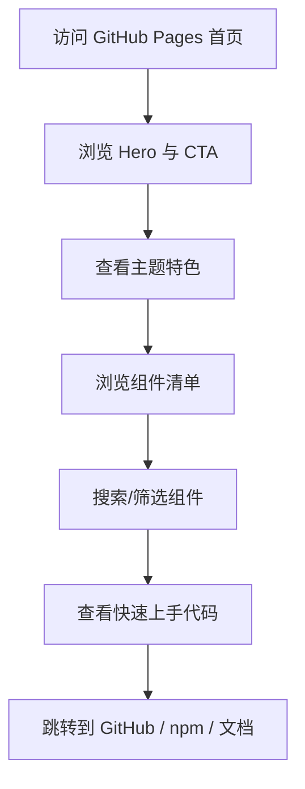

## 1. 产品概述
一个可直接部署到 GitHub Pages 的单页宣传站（入口为 index.html），用于展示 Zhui（中国风 React 组件库）的设计特色、组件清单与快速上手方式，面向潜在用户与贡献者。

## 2. 核心功能

### 2.1 功能模块
1. **首页（单页）**：品牌与定位、特色卖点、组件总览、快速上手、链接与页脚

### 2.2 页面明细
| 页面名称 | 模块名称 | 功能描述 |
|---|---|---|
| 首页 | 顶部导航 | 锚点跳转：特色 / 组件 / 上手 / 链接 |
| 首页 | Hero 区域 | 标题、Slogan、CTA 按钮（GitHub / npm / 文档或 Storybook） |
| 首页 | 特色展示 | 3–6 个卖点卡片（中国风设计、轻量、易用、可定制等） |
| 首页 | 组件清单 | 以卡片网格展示所有支持组件；支持搜索/筛选；点击可展开说明与示例（静态） |
| 首页 | 快速上手 | 安装与使用代码片段、常用命令 |
| 首页 | 生态链接 | README、Issue、贡献指南等入口 |
| 首页 | 页脚 | 版权、许可证、仓库地址 |

## 3. 核心流程
用户流程：进入首页 → 浏览特色 → 查看组件清单（搜索/筛选）→ 查看上手方式 → 点击 CTA 跳转到仓库/文档。

## 4. 用户界面设计

### 4.1 设计风格
- 视觉方向：现代排版 + 中国风细节（宣纸质感、墨色渐变、朱砂点缀、印章式按钮细节）
- 主色：墨黑（#0F1115）/ 宣纸白（#F7F1E6）
- 强调色：朱砂红（#C23A2B）
- 字体：标题使用中文衬线（如 Noto Serif SC），正文使用中文无衬线（如 Noto Sans SC）
- 动效：首屏分段淡入、组件卡片 hover 浮起与微弱阴影、锚点滚动平滑

### 4.2 页面设计概览
| 页面名称 | 模块名称 | UI 元素 |
|---|---|---|
| 首页 | Hero | 大标题、短 Slogan、双 CTA、背景纹理/渐变、轻量动效 |
| 首页 | 特色展示 | 3–6 张卡片、图形点缀（SVG/纯 CSS）、对比度清晰 |
| 首页 | 组件清单 | 搜索框、筛选标签、卡片网格、展开详情面板 |
| 首页 | 快速上手 | 代码块、复制按钮、命令列表 |

### 4.3 响应式
- 桌面优先，移动端自适应
- 组件网格：桌面 3–4 列、平板 2 列、手机 1 列
- 导航在小屏自动折叠为简化布局（不依赖外部框架）
