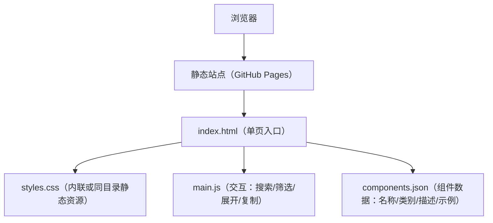

## 1. 架构设计

## 2. 技术说明
- 站点形态：纯静态单页（HTML + CSS + 原生 JS），无需构建工具即可部署
- 资源策略：尽量减少外部依赖；字体可通过 CDN 引入（也可改为系统字体降级）
- 可访问性：语义化结构、可键盘操作、颜色对比度达标、prefers-reduced-motion 支持
- 性能：单文件优先（允许将 CSS/JS 内联到 index.html），首屏资源尽量小

## 3. 路由定义
| 路由 | 用途 |
|---|---|
| / | 宣传首页（index.html） |

## 4. 交互与数据设计
- 组件清单数据：使用 components.json 维护组件元信息，前端渲染列表
- 搜索：按名称/关键词模糊匹配（前端过滤）
- 筛选：按类别（如 表单/反馈/导航/数据展示 等）进行筛选
- 展开详情：点击卡片展开静态示例与简短说明
- 复制代码：复制安装/使用片段到剪贴板（Clipboard API，失败则降级提示）

## 5. 部署约束（GitHub Pages）
- 入口文件必须为仓库根目录的 index.html
- 静态资源（如 components.json）使用相对路径引用，确保在子路径/自定义域名下可用
- 不依赖服务端渲染与后端 API
